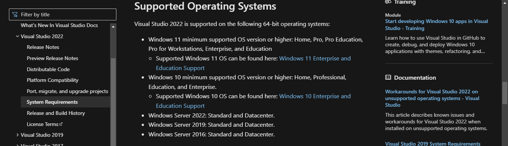
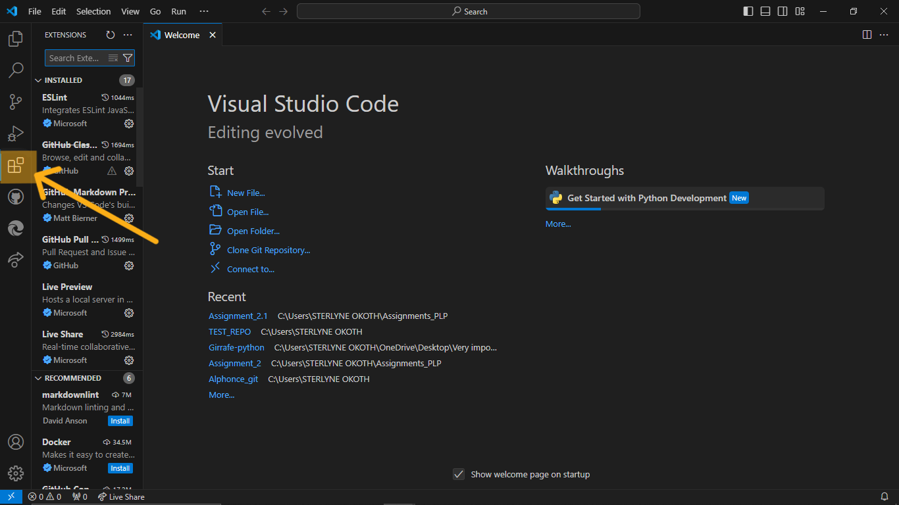
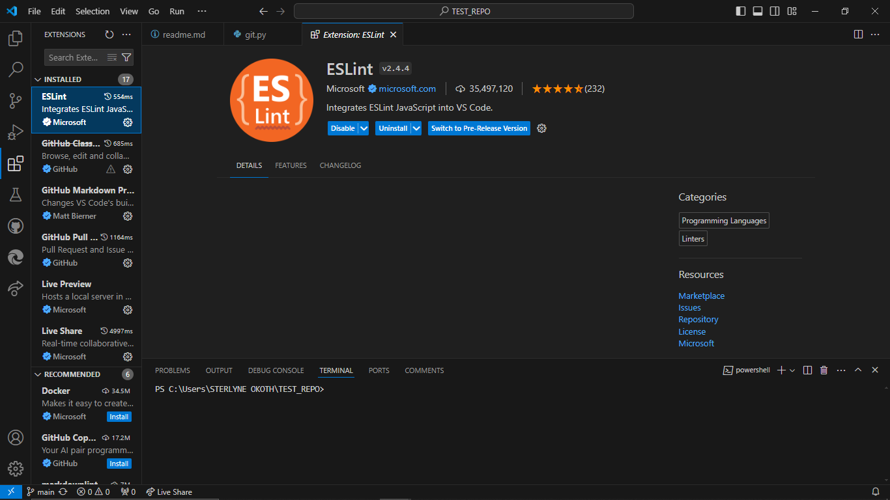

# SE-Assignment-5
Installation and Navigation of Visual Studio Code (VS Code)
 Instructions:
Answer the following questions based on your understanding of the installation and navigation of Visual Studio Code (VS Code). Provide detailed explanations and examples where appropriate.

 Questions:

1. Installation of VS Code:
   - Describe the steps to download and install Visual Studio Code on Windows 11 operating system. Include any prerequisites that might be needed.

   Step 1 - 
      Before you begin installing Visual Studio:

      Check the system requirements. These requirements help you know whether your computer supports Visual Studio.
      Make sure that the user performing the initial installation has administrator permissions on the machine.
       

      Apply the latest Windows updates. These updates ensure that your computer has both the latest security updates and the required system components for Visual Studio.
      Reboot. The reboot ensures that any pending installs or updates don't hinder your Visual Studio install.
      Free up space. Remove unneeded files and applications from your system drive by, for example, running the Disk Cleanup app.
       

   Step 2 -
      Go to the Visual Studio Code download page. [https://code.visualstudio.com/]
      Determine which version and edition of Visual Studio to install

      

   Step 3 - 
      Initiate the installation.

   Step 4 - 
      Choose workloads
      After the Visual Studio Installer is installed, you can use it to customize your installation by selecting the feature sets—or workloads—that you want.

      

      Select the workload you want in the Visual Studio Installer.
      After you choose the workload you want, select Install.

      Wait for the installation to complete.  

   Step 5 - 
      Launch VS Code:

      After installation, check "Launch Visual Studio Code" and click "Finish".
      VS Code will start, and you can start using it immediately.

2. First-time Setup:
   - After installing VS Code, what initial configurations and settings should be adjusted for an optimal coding environment? Mention any important settings or extensions.
  
  

    User Interface Settings:

   Theme: 
      Choose a theme that is comfortable for your eyes.
      Go to File > Preferences > Color Theme.
      Select from Light, Dark, or High Contrast themes.

   Font Size and Family:
      Go to File > Preferences > Settings.
      Search for "Font Size" and adjust as needed.
      Search for "Font Family" and set to your preferred font (e.g., Fira Code, Source Code Pro).

   Tab Size and Spaces:
      In Settings, search for "Tab Size" and set it (e.g., 4).
      Set "Insert Spaces" to use spaces instead of tabs.

   Auto Save:
      Enable auto save by setting "Files: Auto Save" to "afterDelay"

   Extensions: 
      Language Support:
         Python: Install the "Python" extension.
         JavaScript/TypeScript: Install the "ESLint" extension.
         HTML/CSS: Install "HTML CSS Support".
         C/C++: Install the "C/C++" extension.

      Code Formatting:
         Prettier - Code formatter: Install this for consistent code formatting.
         ESLint: For JavaScript/TypeScript linting.

      Version Control:
         GitLens: Enhances Git capabilities within VS Code.

      Live Server:
         Install "Live Server" to launch a development local server with live reload feature for static and dynamic pages.
         Settings Sync:

         Sync your settings, extensions, and preferences by signing in with your GitHub or Microsoft account.
         Go to File > Preferences > Settings Sync > Turn On Settings Sync.
         Follow the prompts to sign in and enable sync.

1. User Interface Overview:
   - Explain the main components of the VS Code user interface. Identify and describe the purpose of the Activity Bar, Side Bar, Editor Group, and Status Bar.

   Activity Bar:
   

      Location: The vertical bar on the far left side of the window.
      Purpose: Provides access to different views and features in VS Code.
      Components:
      Explorer: View and manage your project files and folders.
      Search: Perform searches across your entire project.
      Source Control: Manage version control using Git or other SCM providers.
      Run and Debug: Access debugging features and configurations.
      Extensions: Browse and install VS Code extensions to enhance functionality.

   Side Bar:
   

      Location: To the right of the Activity Bar.
      Purpose: Displays contextual information and tools related to the currently selected activity in the Activity Bar.
      Components:
      File Explorer: Navigate and manage your project’s files and folders.
      Search Panel: View search results and navigate to matches.
      Source Control Panel: View and manage source control changes, branches, and repositories.
      Debug Panel: View variables, watch expressions, call stacks, and breakpoints during debugging.
      Extensions Panel: Manage installed extensions and browse new ones.

   Editor Group:
   

      Location: The central area of the VS Code window.
      Purpose: The main area where you edit your code files.
      Components:
      Tabs: Each open file is represented by a tab at the top of the editor group.
      Split Editors: You can split the editor into multiple groups to view and edit multiple files side-by-side.
      Minimap: A small overview of your code on the right side of the editor, allowing for quick navigation.

   Status Bar:
   

      Location: The horizontal bar at the bottom of the window.
      Purpose: Provides information about the current state of the editor and your project.
      Components:
      Current Branch: Shows the current Git branch.
      Problems Indicator: Shows the number of errors and warnings in the current project.
      Language Mode: Indicates the programming language of the current file and allows changing the language mode.
      Line and Column Numbers: Displays the current cursor position in the file.
      Encoding: Shows the file encoding (e.g., UTF-8) and allows changing it.
      EOL (End of Line) Sequence: Shows the current EOL sequence (e.g., LF, CRLF) and allows changing it.
      Notifications: Displays notifications and messages from VS Code and extensions.

2. Command Palette:
   
   - What is the Command Palette in VS Code, and how can it be accessed? Provide examples of common tasks that can be performed using the Command Palette.

      Command Palette in VS Code
      The Command Palette in Visual Studio Code is a powerful tool that allows users to execute various commands and operations within the editor. It provides a quick and efficient way to access functionalities without needing to navigate through menus or remember keyboard shortcuts.

            To access the command palette; Click on View > Command Palette.

   Examples of Common Tasks

      Open File:
         Type "Open File" or "File: Open File".
         Enter the path to the file you want to open.

      Search for Symbols:
         Type "Go to Symbol" or "Symbols: Go to Symbol in File".
         Enter the symbol name to navigate to its definition.

      Change Language Mode:
         Type "Change Language Mode".
         Select the desired language mode from the list.

      Toggle Word Wrap:
         Type "Toggle Word Wrap".
         Enable or disable word wrap in the editor.

      Indentation:
         Type "Indentation".
         Choose indentation settings for the current file.

      Extensions Management:
         Type "Extensions: Install Extensions".
         Search for and install VS Code extensions.

      Version Control:
         Type "Git: Commit" or "Git: Pull".
         Perform version control operations like committing changes or pulling from a remote repository.

      Run and Debug:
         Type "Debug: Start Debugging" or "Run: Start Without Debugging".
         Launch debugging sessions or run code without debugging.

3. Extensions in VS Code:
   - Discuss the role of extensions in VS Code. How can users find, install, and manage extensions? Provide examples of essential extensions for web development.

      Extensions in Visual Studio Code (VS Code) enhance its functionality by adding new features, tools, and language support. They allow users to customize their coding environment to suit their specific needs and workflows. Extensions can range from language support for programming languages to debuggers, linters, themes, and more.

   Finding Extensions:
   

      Open the Extensions view by clicking on the Extensions icon in the Activity Bar or pressing Ctrl+Shift+X.
      Use the search bar to find extensions by name or functionality.

   Installing Extensions:
   
      Click on the extension you want to install.
      Click the "Install" button next to the extension description.
      Wait for the installation to complete.

   Managing Extensions:

      Disable or uninstall extensions by clicking on the gear icon next to the extension name in the Extensions view.
      Update extensions to their latest versions manually or automatically.

   Examples of Essential Extensions for Web Development

      HTML CSS Support:
      Provides HTML and CSS language support with autocomplete, syntax highlighting, and formatting.

   Auto Rename Tag:
      Automatically renames paired HTML/XML tags.

   Live Server:
      Launches a local development server with live reload capability for static and dynamic web pages.

   ESLint:
      Integrates ESLint for JavaScript/TypeScript linting and code quality analysis.

   Prettier - Code Formatter:
      Formats code according to predefined code styles automatically.

   Debugger for Chrome:
      Allows debugging JavaScript code in the Chrome browser directly from VS Code.

4. Integrated Terminal:
   
   - Describe how to open and use the integrated terminal in VS Code. What are the advantages of using the integrated terminal compared to an external terminal?
  
      Opening and Using the Integrated Terminal in VS Code
      Opening the Integrated Terminal

   From the Menu:
      Click on View > Terminal.

   From the Command Palette:
      Press Ctrl+Shift+P

   Running Tasks:
      Run tasks defined in the workspace's tasks.json file using the tasks command.

         The integrated terminal is part of the VS Code interface, providing a seamless development experience without switching between applications.

   The advantages of using the integrated terminal compared to an external terminal;

      Contextual Awareness:
         The terminal automatically opens to the workspace root directory, providing context-specific access to project files and resources.

      Efficient Workflow:
         Quickly execute commands and tasks directly within the editor environment, improving workflow efficiency.

      Enhanced Productivity:
         Access VS Code features and extensions while working in the terminal, such as code navigation, IntelliSense, and Git integration.

      Workspace State Preservation:
         Terminal sessions persist across VS Code sessions, preserving workspace state and command history.

      Consistency Across Platforms:
         Provides a consistent terminal experience across different platforms (Windows, macOS, Linux) within VS Code.

   Customization and Extension:
      Customize terminal appearance, behavior, and key bindings to suit personal preferences.
      Extend functionality with terminal-specific VS Code extensions.

5. File and Folder Management:
   - Explain how to create, open, and manage files and folders in VS Code. How can users navigate between different files and directories efficiently?
  
  
   Creating a New File:
      Click on the Explorer icon in the Activity Bar.
      Right-click on the desired folder or workspace.
      Select "New File" from the context menu.
      Enter the file name and press Enter.

   Creating a New Folder:
      Click on the Explorer icon in the Activity Bar.
      Right-click on the desired folder or workspace.
      Select "New Folder" from the context menu.
      Enter the folder name and press Enter.

   Renaming Files and Folders:
      Right-click on the file or folder in the Explorer view.
      Select "Rename" from the context menu.
      Enter the new name and press Enter.

   Deleting Files and Folders:
      Right-click on the file or folder in the Explorer view.
      Select "Delete" from the context menu.
      Confirm the deletion.

   Moving and Copying Files:
      Right-click on the file or folder in the Explorer view.
      Select "Cut" or "Copy" from the context menu.
      Navigate to the destination folder.
      Right-click and select "Paste".

   Navigating Between Files and Directories.

      Using Keyboard Shortcuts:
         Press Ctrl+P Windows/Linux to open the Quick Open menu.
         Start typing the file name to quickly navigate to it.

      Using the Explorer View:
         Click on the Explorer icon in the Activity Bar.
         Navigate through folders by clicking on them.

      Using the Command Palette:
         Press Ctrl+Shift+P to open the Command Palette.
         Type "File: Open File" to quickly open a specific file.

6. Settings and Preferences:
   - Where can users find and customize settings in VS Code? Provide examples of how to change the theme, font size, and keybindings.
  
      Use the Settings editor to review and change VS Code settings. To open the Settings editor, navigate to File > Preferences > Settings. Alternately, open the Settings editor from the Command Palette (Ctrl+Shift+P) with Preferences: Open Settings or use the keyboard shortcut (Ctrl+,).
      
   Changing the Theme:
   
      Open the Settings view (Ctrl+,).
      Search for "Color Theme".
      Select your desired theme from the dropdown list.

   Adjusting Font Size:
      Open the Settings view (Ctrl+,).
      Search for "Font Size".
      Modify the value to adjust the font size.

7. Debugging in VS Code:
   - Outline the steps to set up and start debugging a simple program in VS Code. What are some key debugging features available in VS Code?

   Open your project in VS Code.
   Create or modify the launch.json file in the .vscode folder.
   Define a launch configuration for your programming language and environment.

   Navigate to the file containing the code you want to debug.
   Click on the area to the left of the line number to set a breakpoint.
   Starting Debugging

   Open the Run and Debug view by clicking on the Run icon in the Activity Bar or pressing Ctrl+Shift+D.
   Select the desired launch configuration from the dropdown menu.
   Click on the green play button to start debugging.

   Key Debugging Features
   Breakpoints:
   Set breakpoints to pause execution at specific lines of code for inspection.

   Step Through Code:
   Step through code line by line using commands like Step Over, Step Into, and Step Out.

   Watch and Variables:
   View the current state of variables and expressions in the Watch view.
   Hover over variables to see their current values in the editor.

   Call Stack:
   View the call stack to understand the sequence of function calls leading up to the current point in execution.

   Conditional Breakpoints:
   Set breakpoints that only trigger when specific conditions are met.

   Debug Console:
   Use the Debug Console to execute ad-hoc code and evaluate expressions during debugging.

8.   Using Source Control:
    - How can users integrate Git with VS Code for version control? Describe the process of initializing a repository, making commits, and pushing changes to GitHub.

   Initialize Repository:

      Open the Source Control view by clicking on the Source Control icon in the Activity Bar on the side or by pressing Ctrl+Shift+G.
      Click on the "Initialize Repository" button (+) at the top of the Source Control view.

   Stage Changes:
   
      In the Source Control view, you'll see a list of changes. Click on the + icon next to the files you want to stage for commit.

   Commit Changes:
   
      Enter a commit message in the text box provided at the top of the Source Control view.
      Click the checkmark icon or use the keyboard shortcut Ctrl+Enter to commit the changes.

   Push Changes to GitHub:
   
      Create a repository on GitHub.
      In VS Code, go to the Source Control view and click on the ellipsis (...) next to the commit message.
      Select "Push" from the dropdown menu.
      If prompted, choose the remote repository where you want to push your changes (typically origin for GitHub).
      Enter your GitHub credentials if prompted.
      Once the push is complete, your changes will be reflected on GitHub.

 Submission Guidelines:
- Your answers should be well-structured, concise, and to the point.
- Provide screenshots or step-by-step instructions where applicable.
- Cite any references or sources you use in your answers.
- Submit your completed assignment by 1st July 

